# SCHEMA — MediAssist AI Database Schema (all agents, single file)

Single source of truth for every table in the platform. One Postgres database, one Django project, one app per agent plus a shared `core` app. Build each app's tables when you reach that agent's BUILD_STEPS doc — the schema is listed here in full so cross-agent foreign keys are designed once.

**Global conventions (apply to every table, not repeated below):**

- Primary key: `id BIGSERIAL` (Django default `BigAutoField`)
- `created_at DATETIME auto_now_add`, `updated_at DATETIME auto_now` on every table
- All enums are `CharField(choices=...)` with a CHECK constraint (Django generates it); enum values listed per field
- FKs are `on_delete=PROTECT` for clinical data (never silently cascade-delete patient history); `CASCADE` only for pure child rows (messages of a conversation, package of a referral)
- JSON columns are Postgres `jsonb` (`models.JSONField`)
- Cross-app FKs use Django string references (`"refills.Pharmacy"`) to avoid import cycles

---

## App: `core` (shared — Agent 2 Phase 0 + ORCHESTRATION §2)

### core.Patient
| Field | Type | Notes |
|---|---|---|
| first_name / last_name | CharField(100) | |
| dob | DateField | indexed with phone for duplicate search |
| phone | CharField(20) | normalized E.164; **db_index** |
| email | EmailField | nullable |
| address | JSONField | line1, line2, city, state, postal_code |
| emergency_contact | JSONField | name, relation, phone (nullable) |
| preferred_language | CharField(10) | ISO code, default `"en"` |
| preferred_pharmacy | FK → refills.Pharmacy | nullable, SET_NULL |
| identity_verified | BooleanField | default False |
| registration_status | CharField | `in_progress` / `verified` / `duplicate_detected` / `complete` |
| communication_preferences | JSONField | `{preferred_channel, opted_out: {sms, email, voice, whatsapp}}` |

Constraints: index `(phone, dob)` — duplicate-detection lookup (FR-R3).

### core.Doctor
| Field | Type | Notes |
|---|---|---|
| name | CharField(150) | |
| specialty | CharField(80) | **db_index** (doctor selection, FR-S2) |
| working_hours | JSONField | `{mon: [["09:00","13:00"],["14:00","17:00"]], ...}` |
| avg_consult_minutes | IntegerField | default 20 |
| buffer_minutes | IntegerField | default 5 |
| holidays | JSONField | list of ISO dates |
| is_active | BooleanField | |

### core.Conversation
| Field | Type | Notes |
|---|---|---|
| patient | FK → Patient | nullable (pre-auth sessions) |
| channel | CharField | `web` / `portal` / `app` / `sms` / `whatsapp` / `voice` |
| started_at / ended_at | DateTimeField | ended_at nullable |
| agent_context | JSONField | scratch state passed between agents (current intent stack, verified flag) |

### core.Message
| Field | Type | Notes |
|---|---|---|
| conversation | FK → Conversation | CASCADE |
| role | CharField | `patient` / `assistant` / `system` / `staff` |
| content | TextField | |
| agent | CharField(30) | which agent produced/handled it (audit, FR-A8) |

### core.OTPChallenge
| Field | Type | Notes |
|---|---|---|
| patient | FK → Patient | |
| code_hash | CharField(128) | never store the plain code |
| channel | CharField | `sms` / `email` |
| expires_at | DateTimeField | 10 min |
| attempts | IntegerField | max 5 |
| consumed_at | DateTimeField | nullable |

### core.SentNotification
| Field | Type | Notes |
|---|---|---|
| patient | FK → Patient | nullable (staff notifications too) |
| recipient | CharField(150) | phone/email actually used |
| channel | CharField | `sms` / `email` / `voice` / `whatsapp` / `push` / `console` |
| template | CharField(80) | logical template name |
| rendered_content | TextField | |
| status | CharField | `queued` / `sent` / `delivered` / `failed` |
| provider_message_id | CharField(100) | nullable |

### core.AuditEvent  *(NFR-4 — written by core.ehr functions)*
| Field | Type | Notes |
|---|---|---|
| actor_type | CharField | `patient` / `staff` / `agent` / `system` |
| actor_id | CharField(64) | |
| action | CharField(80) | `record_encounter`, `prescription_approved`, ... |
| patient | FK → Patient | nullable, **db_index** |
| payload | JSONField | what was written |

### core.EventLog  *(ORCHESTRATION §3 dispatcher)*
| Field | Type | Notes |
|---|---|---|
| name | CharField(60) | `registration.completed`, ... **db_index** |
| payload | JSONField | |
| processed | BooleanField | |
| error | TextField | nullable — subscriber failure detail |

---

## App: `scheduling` (Agent 1)

### scheduling.Appointment
| Field | Type | Notes |
|---|---|---|
| doctor | FK → core.Doctor | |
| patient | FK → core.Patient | |
| start / end | DateTimeField | |
| reason | TextField | |
| urgency | CharField | `emergency` / `high` / `medium` / `low` / `routine` |
| status | CharField | `booked` / `confirmed` / `completed` / `cancelled` / `no_show` |
| room | CharField(30) | nullable (FR-S4 "if needed") |
| source | CharField(30) | which agent booked it: `scheduling` / `triage` / `outreach` / `caregaps` / `referrals` / `priorauth` |

Constraints: **exclusion/unique** — no two non-cancelled appointments overlap for one doctor. Simplest portable version: unique `(doctor, start)` + service-layer overlap check inside a `select_for_update` transaction (NFR-5). Index `(doctor, start)`.

### scheduling.Waitlist
| Field | Type | Notes |
|---|---|---|
| patient | FK → core.Patient | |
| doctor | FK → core.Doctor | nullable — may be specialty-level |
| specialty | CharField(80) | |
| urgency | CharField | same enum as Appointment; priority key (FR-S6) |
| preferred_window | JSONField | date range / times of day |
| status | CharField | `waiting` / `offered` / `booked` / `expired` |

Index `(doctor, status, urgency, created_at)` — promotion query.

---

## App: `registration` (Agent 2)

### registration.InsurancePolicy
| Field | Type | Notes |
|---|---|---|
| patient | FK → core.Patient | |
| provider_name | CharField(120) | |
| policy_number / member_id | CharField(60) | |
| coverage_start / coverage_end | DateField | end nullable |
| eligibility_status | CharField | `unknown` / `active` / `inactive` |
| eligibility_checked_at | DateTimeField | nullable |
| raw_extraction | JSONField | what the model read off the card (FR-R4) |

### registration.IntakeSummary
| Field | Type | Notes |
|---|---|---|
| patient | OneToOne → core.Patient | |
| symptoms / medical_history / medications / allergies / family_history / lifestyle | JSONField | structured per FR-R5 |
| summary_text | TextField | physician-readable paragraph (FR-R7) |

### registration.UploadedDocument
| Field | Type | Notes |
|---|---|---|
| patient | FK → core.Patient | |
| file | FileField | store under `MEDIA_ROOT/docs/<patient_id>/` |
| doc_type | CharField | `insurance_card` / `id` / `prescription` / `lab_report` / `referral_letter` / `imaging_report` |
| extracted_data | JSONField | model extraction output (FR-R6) |
| extraction_status | CharField | `pending` / `done` / `failed` |

---

## App: `triage` (Agent 3)

### triage.ClinicalProtocol
| Field | Type | Notes |
|---|---|---|
| name | CharField(120) | e.g. "Adult chest pain" |
| symptom_keywords | JSONField | matching terms |
| question_flow | JSONField | ordered adaptive questions + branch conditions |
| disposition_rules | JSONField | rules → acuity mapping |
| version | IntegerField | |
| approved_by | CharField(120) | FR-T5 governance |
| is_active | BooleanField | |

### triage.TriageAssessment
| Field | Type | Notes |
|---|---|---|
| patient | FK → core.Patient | |
| conversation | FK → core.Conversation | |
| protocol | FK → ClinicalProtocol | nullable (emergency short-circuit skips it) |
| reported_symptoms | JSONField | |
| findings | JSONField | accumulated structured answers |
| acuity | CharField | `emergency` / `high` / `medium` / `low` / `minimal` (FR-T4), nullable until complete |
| disposition | CharField | `ed_now` / `same_day` / `24_48h` / `routine` / `self_care` |
| summary_text | TextField | clinician summary (FR-T9) |
| status | CharField | `in_progress` / `complete` / `escalated` |

### triage.EscalationAlert
| Field | Type | Notes |
|---|---|---|
| assessment | FK → TriageAssessment | nullable — other agents escalate too |
| patient | FK → core.Patient | |
| source_agent | CharField(30) | |
| category | CharField | `emergency` / `mental_health` / `stroke` / `controlled_substance` / `insurance_dispute` / `other` |
| priority | CharField | `critical` / `high` / `normal` |
| summary | TextField | AI-prepared (FR-T8) |
| acknowledged_at / acknowledged_by | DateTime / CharField | nullable |
| status | CharField | `open` / `acknowledged` / `resolved` |

---

## App: `refills` (Agent 4)

### refills.Pharmacy
| Field | Type | Notes |
|---|---|---|
| name | CharField(150) | |
| address | JSONField | |
| phone / fax | CharField(20) | |
| erx_identifier | CharField(60) | e-prescription network ID, nullable |

### refills.Prescription
| Field | Type | Notes |
|---|---|---|
| patient | FK → core.Patient | **db_index** |
| prescriber | FK → core.Doctor | |
| medication_name | CharField(150) | |
| dose / quantity | CharField(60) / CharField(40) | |
| refills_allowed / refills_used | IntegerField | FR-M4 |
| prescribed_date / expiry_date | DateField | |
| status | CharField | `active` / `discontinued` / `expired` |
| required_labs | JSONField | list of `{test, max_age_days}` (FR-M3) |
| followup_required | BooleanField | |
| is_controlled_substance | BooleanField | **never auto-processed** (Edge Case 12) |

### refills.RefillRequest
| Field | Type | Notes |
|---|---|---|
| prescription | FK → Prescription | |
| patient | FK → core.Patient | |
| pharmacy | FK → Pharmacy | |
| status | CharField | `received` / `eligibility_check` / `paused` / `pending_approval` / `approved` / `rejected` / `visit_required` / `sent_to_pharmacy` / `ready_for_pickup` |
| pause_reason | CharField(200) | nullable (Edge Case 2) |
| renewal_summary | JSONField | structured FR-M5 data |
| summary_text | TextField | AI one-paragraph physician summary |
| decided_by | FK → core.Doctor | nullable |
| decided_at | DateTimeField | nullable |

---

## App: `referrals` (Agent 5)

### referrals.Specialist
| Field | Type | Notes |
|---|---|---|
| name / practice_name | CharField(150) | |
| specialty | CharField(80) | **db_index** |
| address | JSONField | include `postal_code` for distance ranking |
| accepted_insurances | JSONField | list of provider names |
| languages | JSONField | |
| accepting_new_patients | BooleanField | |
| contact_channel | CharField | `phone` / `e_referral` / `email` / `api` |
| consultation_fee | DecimalField | nullable |
| internal_doctor | OneToOne → core.Doctor | nullable — in-network specialists reuse the scheduling calendar |

### referrals.Referral
| Field | Type | Notes |
|---|---|---|
| patient | FK → core.Patient | |
| referring_doctor | FK → core.Doctor | |
| specialist | FK → Specialist | nullable until matched |
| specialty_needed | CharField(80) | |
| reason | TextField | |
| urgency | CharField | as Appointment enum |
| status | CharField | `created` / `accepted` / `appointment_scheduled` / `patient_confirmed` / `visit_completed` / `report_received` / `closed` / `stalled` (FR-F7) |
| status_history | JSONField | `[{status, at}]` timeline |
| appointment | FK → scheduling.Appointment | nullable (internal bookings) |
| external_appointment_at | DateTimeField | nullable (external offices) |

### referrals.ReferralPackage
| Field | Type | Notes |
|---|---|---|
| referral | OneToOne → Referral | CASCADE |
| selected_chart_data | JSONField | only specialty-relevant items (FR-F2) |
| summary_text | TextField | AI referral summary |
| attached_documents | JSONField | list of registration.UploadedDocument ids (FR-F4) |

### referrals.ConsultationReport
| Field | Type | Notes |
|---|---|---|
| referral | OneToOne → Referral | |
| diagnosis / treatment_plan | TextField | |
| medications / followup_recommendations | JSONField | |
| source_document | FK → registration.UploadedDocument | nullable |

---

## App: `priorauth` (Agent 6)

### priorauth.PayerRule
| Field | Type | Notes |
|---|---|---|
| payer_name / plan | CharField(120) | matched against InsurancePolicy.provider_name |
| cpt_pattern / icd10_pattern / medication_pattern | CharField(60) | glob/regex, nullable |
| network_requirement | CharField | `in_network` / `any`, nullable |
| requires_auth | BooleanField | |
| submission_channel | CharField | `api` / `epa` / `portal` / `fax` |
| required_documentation | JSONField | list of evidence categories (FR-P2) |

### priorauth.TreatmentOrder
| Field | Type | Notes |
|---|---|---|
| patient | FK → core.Patient | |
| ordering_doctor | FK → core.Doctor | |
| order_type | CharField | `medication` / `imaging` / `procedure` / `device` / `therapy` |
| cpt_code / icd10_code | CharField(10) | nullable per type |
| medication | CharField(150) | nullable |
| referral | FK → referrals.Referral | nullable |

### priorauth.AuthorizationRequest
| Field | Type | Notes |
|---|---|---|
| order | OneToOne → TreatmentOrder | |
| policy | FK → registration.InsurancePolicy | |
| matched_rule | FK → PayerRule | nullable |
| status | CharField | `detected` / `gathering_evidence` / `ready_for_review` / `submitted` / `under_review` / `info_requested` / `approved` / `denied` (FR-P5) |
| status_history | JSONField | timeline |
| denial_reason | TextField | nullable |
| appeal_suggested | BooleanField | FR-P7 |
| external_reference | CharField(80) | payer's case number, nullable |

### priorauth.AuthorizationPackage
| Field | Type | Notes |
|---|---|---|
| request | OneToOne → AuthorizationRequest | CASCADE |
| demographics_snapshot | JSONField | |
| codes | JSONField | CPT/ICD-10 |
| evidence | JSONField | gathered items by category |
| reviewer_summary | TextField | AI medical-necessity summary (FR-P3) |

### priorauth.PayerMessage
| Field | Type | Notes |
|---|---|---|
| request | FK → AuthorizationRequest | CASCADE |
| direction | CharField | `outbound` / `inbound` |
| content | TextField | full audit trail (FR-P6) |
| parsed | JSONField | structured interpretation |

---

## App: `outreach` (Agent 7)

### outreach.Campaign
| Field | Type | Notes |
|---|---|---|
| name | CharField(150) | |
| clinical_goal | TextField | |
| cohort_criteria | JSONField | shared criteria schema (FR-O1; reused by caregaps) |
| channel_plan | JSONField | ordered, e.g. `[{"channel":"sms","wait_days":0},{"channel":"email","wait_days":3},{"channel":"voice","wait_days":7}]` |
| status | CharField | `draft` / `running` / `paused` / `completed` |
| launched_at | DateTimeField | nullable |

### outreach.CampaignMember
| Field | Type | Notes |
|---|---|---|
| campaign | FK → Campaign | CASCADE |
| patient | FK → core.Patient | |
| state | CharField | `identified` / `contacted` / `responded` / `scheduled` / `completed` / `snoozed` / `opted_out` / `unreachable` |
| snooze_until | DateField | nullable (Edge Case 14) |
| channel_attempts | JSONField | `[{channel, at, message_id}]` |
| outreach_reason | CharField(200) | FR-O3 |
| assigned_physician | FK → core.Doctor | nullable |

Constraints: unique `(campaign, patient)`. Index `(campaign, state)` — funnel queries.

### outreach.OutboundMessage
| Field | Type | Notes |
|---|---|---|
| member | FK → CampaignMember | CASCADE |
| notification | FK → core.SentNotification | delivery handled by core |
| wave_number | IntegerField | which escalation step |

### outreach.InboundResponse
| Field | Type | Notes |
|---|---|---|
| member | FK → CampaignMember | CASCADE |
| raw_text | TextField | |
| classified_intent | CharField | `book` / `snooze` / `opt_out` / `question` / `unclear` |
| snooze_until | DateField | nullable |
| handled | BooleanField | |

---

## App: `caregaps` (Agent 8)

### caregaps.ClinicalGuideline
| Field | Type | Notes |
|---|---|---|
| name | CharField(150) | "HbA1c every 6 months for diabetics" |
| population_criteria | JSONField | same schema as Campaign.cohort_criteria |
| care_item_type | CharField | `screening` / `test` / `vaccination` / `visit` / `followup` |
| care_item_code | CharField(40) | matched against ClinicalEvent.code |
| frequency_days | IntegerField | max allowed gap |
| risk_tier | CharField | `high` / `medium` / `low` (FR-G3) |
| version | IntegerField; is_active BooleanField | |

### caregaps.ClinicalEvent  *(what the scanner reads — populated by EHR layer + document extraction)*
| Field | Type | Notes |
|---|---|---|
| patient | FK → core.Patient | **db_index** |
| event_type | CharField | `lab` / `vaccination` / `visit` / `procedure` / `diagnosis` |
| code | CharField(40) | LOINC/CPT/CVX-style; **db_index** |
| value | JSONField | e.g. `{"hba1c": 8.4}` |
| occurred_at | DateTimeField | |

Index `(patient, code, occurred_at DESC)` — "most recent event of type X".

### caregaps.CareGap
| Field | Type | Notes |
|---|---|---|
| patient | FK → core.Patient | |
| guideline | FK → ClinicalGuideline | |
| status | CharField | `open` / `outreach` / `scheduled` / `completed` / `closed` |
| due_since | DateField | |
| closed_at | DateTimeField | nullable |
| closing_event | FK → ClinicalEvent | nullable (FR-G8 evidence) |

Constraints: **partial unique** `(patient, guideline) WHERE status != 'closed'` — one live gap per patient+guideline.

### caregaps.CarePlan
| Field | Type | Notes |
|---|---|---|
| patient | FK → core.Patient | |
| gaps | M2M → CareGap | bundle (FR-G4) |
| plan_text | TextField | AI patient-facing plan |
| status | CharField | `draft` / `sent` / `accepted` / `in_progress` / `completed` / `recycled` |

---

## App: `frontdesk` (Agent 9)

### frontdesk.PatientSession  *(named to avoid clashing with django.contrib.sessions)*
| Field | Type | Notes |
|---|---|---|
| patient | FK → core.Patient | nullable until authenticated (FR-A3) |
| conversation | OneToOne → core.Conversation | |
| channel | CharField | as Conversation.channel |
| authenticated | BooleanField | |
| pending_intents | JSONField | intents queued behind the auth gate |

### frontdesk.IntentRoute
| Field | Type | Notes |
|---|---|---|
| session | FK → PatientSession | CASCADE |
| intent | CharField | `appointment` / `refill` / `referral_status` / `pa_status` / `care_gap` / `symptoms` / `faq` / `other` |
| target_agent | CharField(30) | |
| status | CharField | `routed` / `completed` / `escalated` |
| payload | JSONField | router extraction |

### frontdesk.KnowledgeArticle
| Field | Type | Notes |
|---|---|---|
| title | CharField(200) | |
| body | TextField | |
| tags | JSONField | |
| search_vector | SearchVectorField | GIN index — Postgres full-text (FR-A5) |

### frontdesk.StaffTask
| Field | Type | Notes |
|---|---|---|
| session | FK → PatientSession | nullable |
| patient | FK → core.Patient | nullable |
| category | CharField | `mental_health` / `stroke` / `insurance_dispute` / `controlled_substance` / `unanswered_question` / `manual_review` |
| priority | CharField | `critical` / `high` / `normal` |
| summary | TextField | |
| status | CharField | `open` / `claimed` / `resolved` |
| claimed_by / resolved_at | CharField / DateTimeField | nullable |

---

## Cross-agent relationship map (the joins that matter)

```
core.Patient ─┬─ scheduling.Appointment ── core.Doctor
              ├─ scheduling.Waitlist
              ├─ registration.{InsurancePolicy, IntakeSummary, UploadedDocument}
              ├─ triage.TriageAssessment ── triage.ClinicalProtocol
              ├─ refills.Prescription ── refills.RefillRequest ── refills.Pharmacy
              ├─ referrals.Referral ─┬─ referrals.Specialist (─ core.Doctor)
              │                      ├─ referrals.ReferralPackage
              │                      ├─ referrals.ConsultationReport
              │                      └─ scheduling.Appointment
              ├─ priorauth.TreatmentOrder ── priorauth.AuthorizationRequest
              │        └─ referrals.Referral      └─ registration.InsurancePolicy
              ├─ outreach.CampaignMember ── outreach.Campaign
              ├─ caregaps.{ClinicalEvent, CareGap ── ClinicalGuideline, CarePlan}
              └─ frontdesk.PatientSession ── core.Conversation ── core.Message
```

Migration order (first `migrate` per app must respect FK targets):
`core` → `scheduling` → `registration` → `triage` → `refills` (then add `Patient.preferred_pharmacy`) → `referrals` → `priorauth` → `outreach` → `caregaps` → `frontdesk`.

---

# ER Diagrams (per agent)

Mermaid `erDiagram` blocks — GitHub and VS Code (with the built-in Markdown preview + Mermaid support) render these visually. Entities prefixed `core_` are shared tables shown for context; each diagram lists only key fields (full field lists are in the tables above). Cardinality legend: `||` exactly one · `o|` zero-or-one · `o{` zero-or-many.

## Shared `core` app

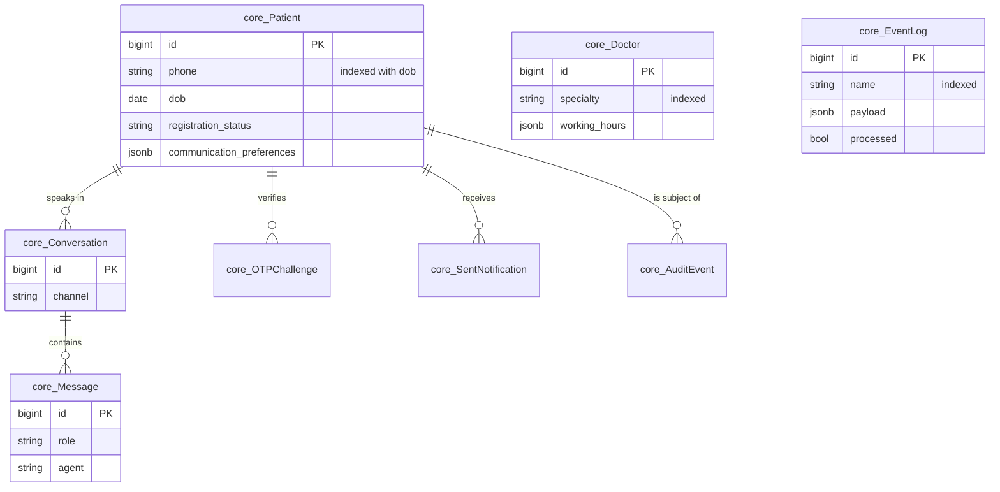

## Agent 1 — Intelligent Scheduling

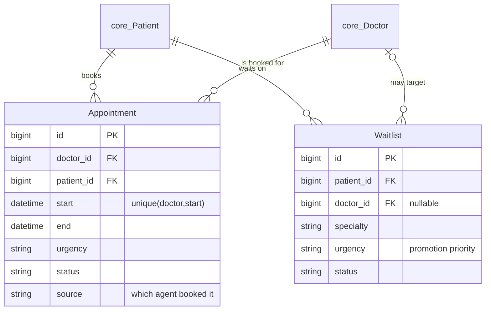

## Agent 2 — Registration & Intake

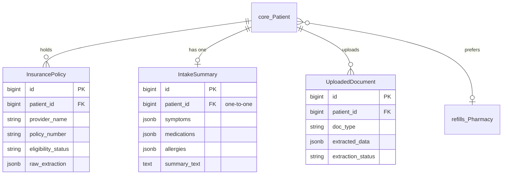

## Agent 3 — Clinical Triage

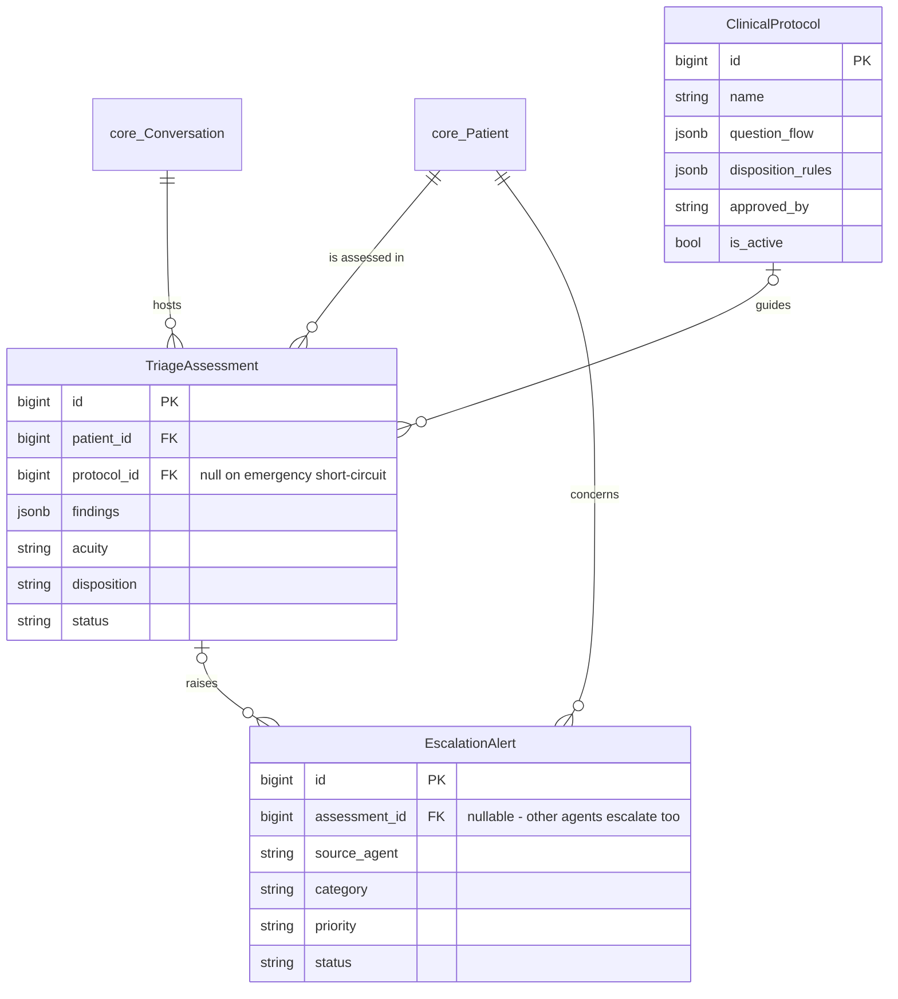

## Agent 4 — Refill Coordination

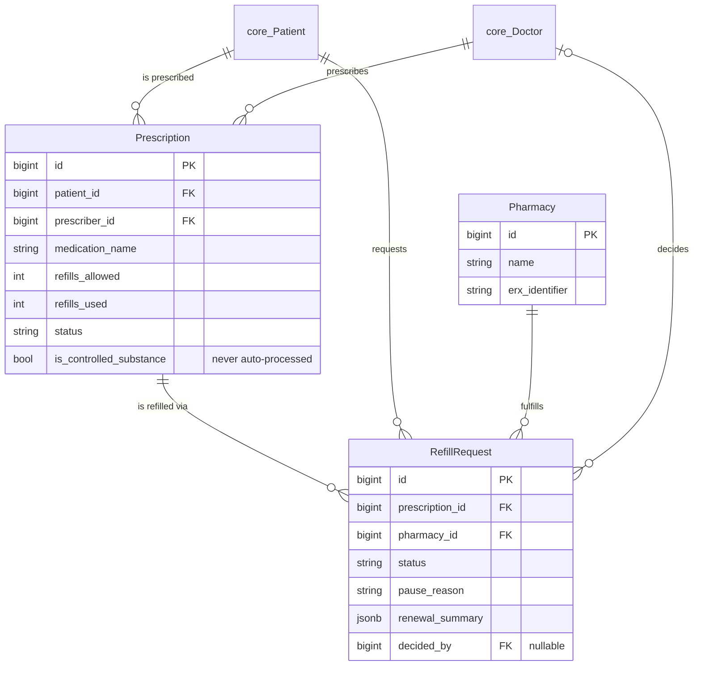

## Agent 5 — Referral Execution

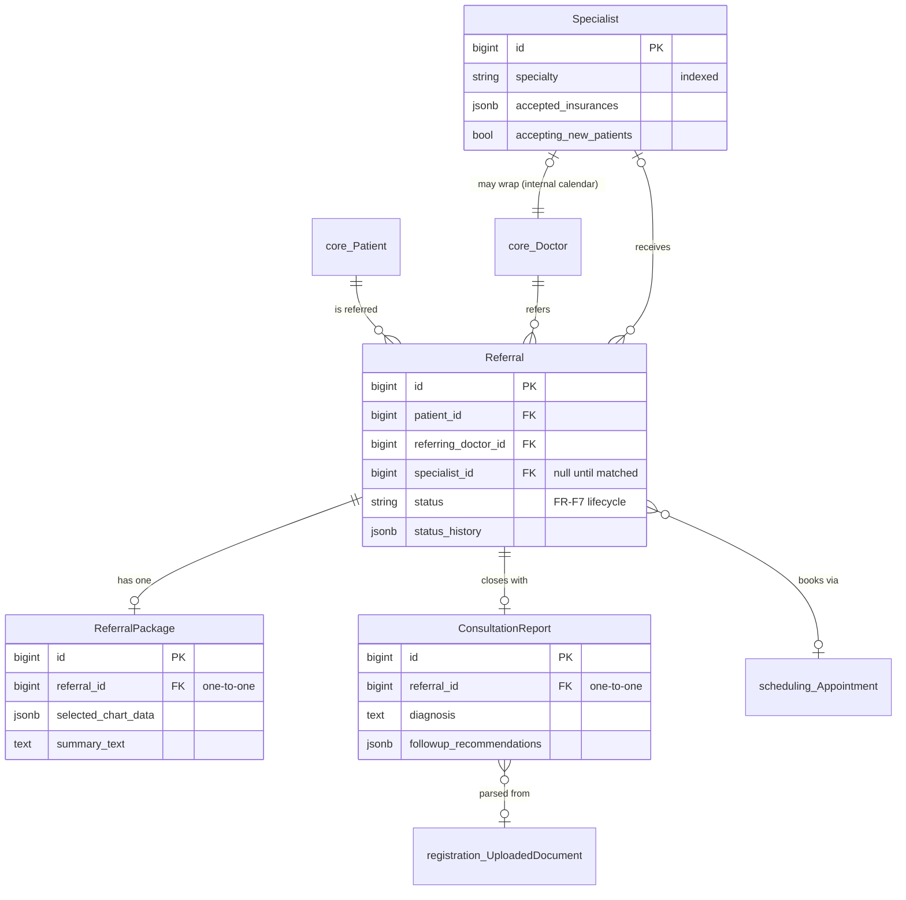

## Agent 6 — Prior Authorization

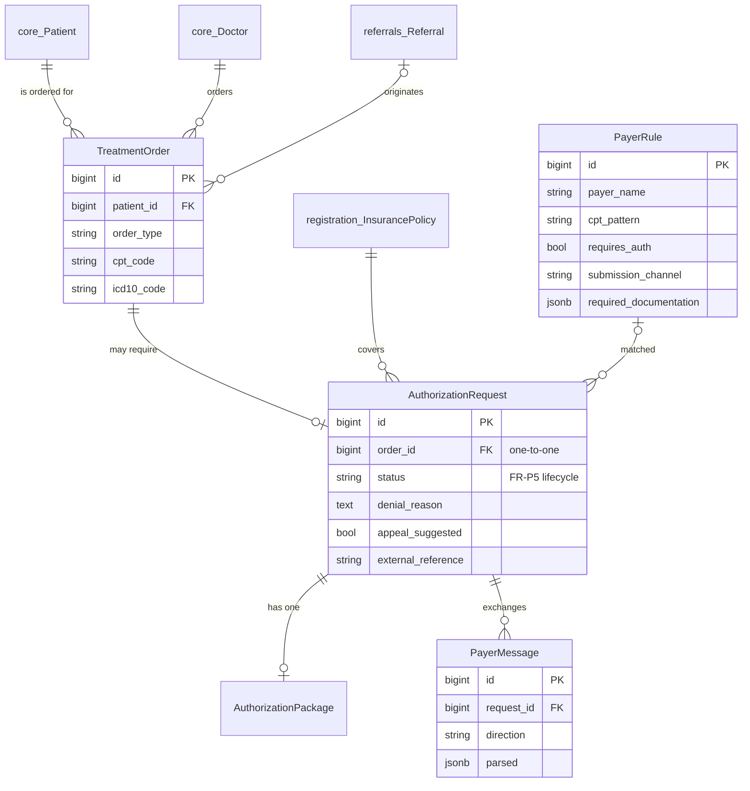

## Agent 7 — Outreach Campaigns

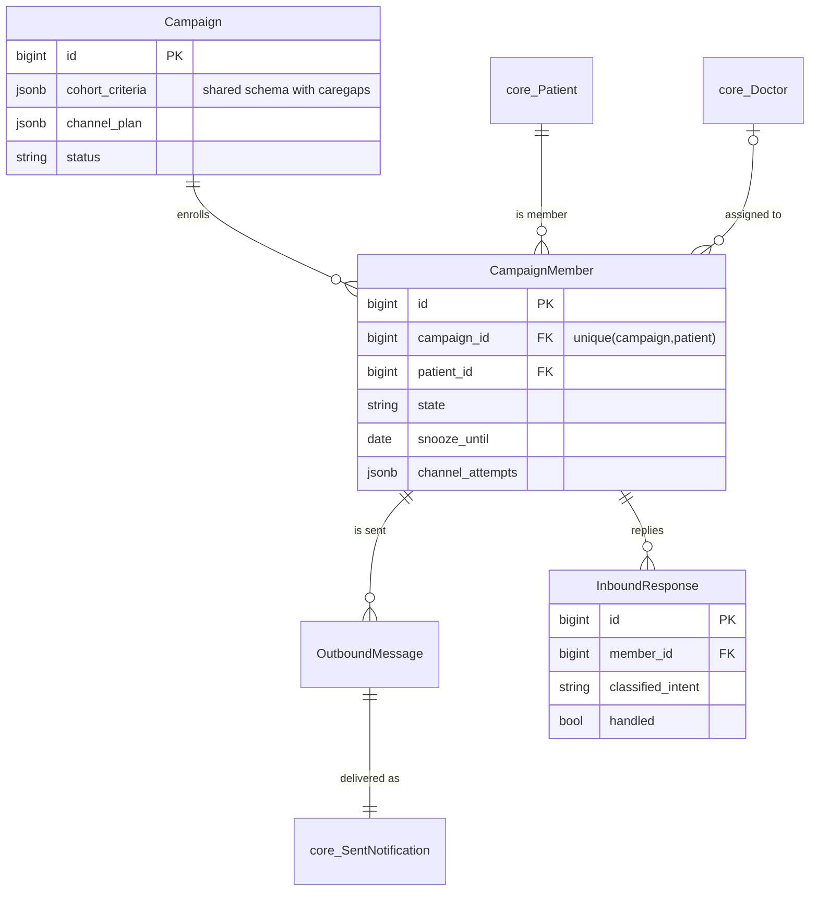

## Agent 8 — Care Gap Closure

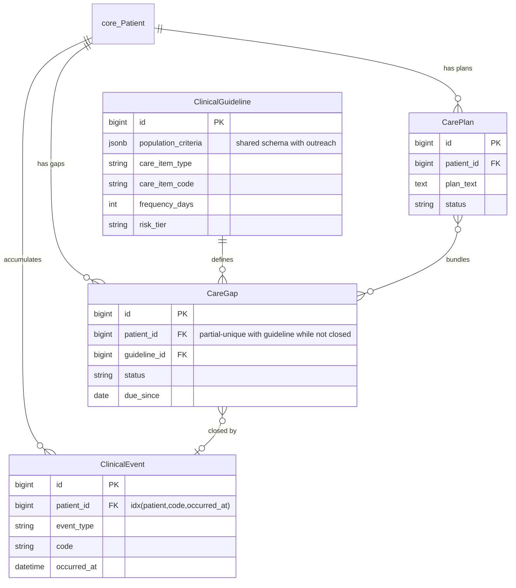

## Agent 9 — After-Hours Orchestration

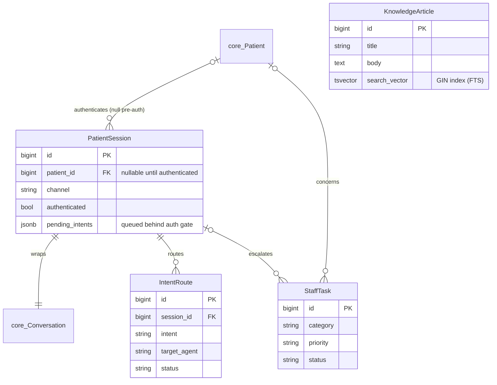

## Platform-wide condensed ERD

Everything hangs off `core_Patient`; one entity per agent shown, child tables collapsed:

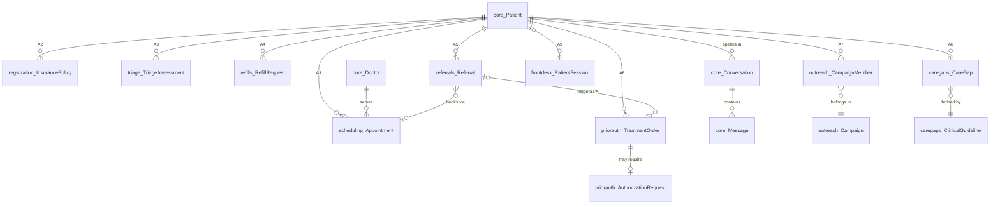
